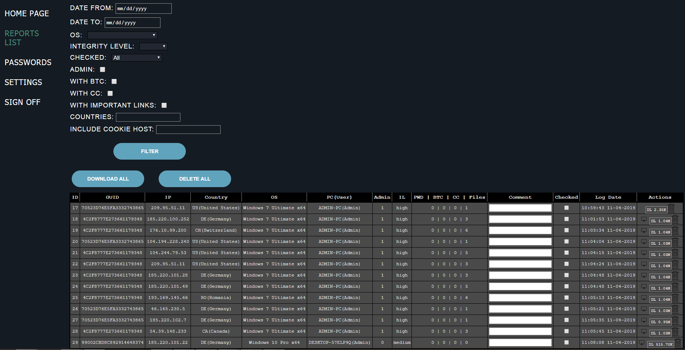
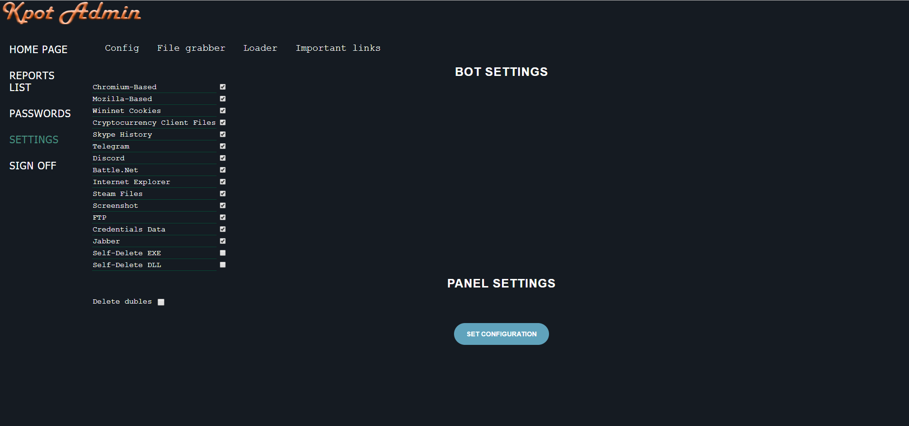
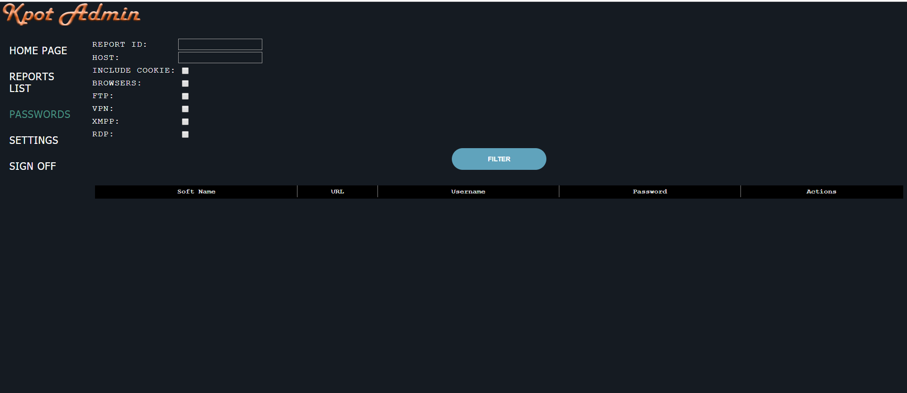
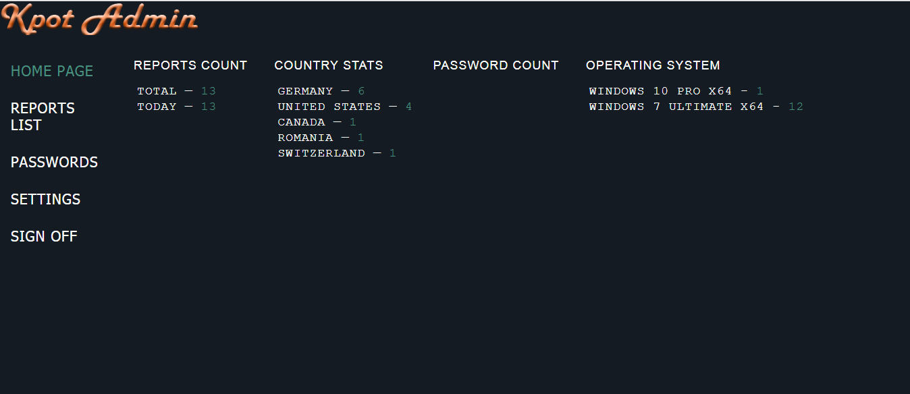

# Finders Keepers (KPot Stealers)


- Samples in the file `samples.zip` the password is `infected`.
- Code for decoding the strings for the stage 2 loader are in the `src` directory
- Slides are located in `docs/index.pdf`
- __KPot V2.1 has been released so if you have samples of this share them with me so I can defeat it too!__

# KPot v2.0 Encrypt/Decrypt Strings and C2 Exiltrated Data

By turning KPot v2.0 against itself with pseudo emulation techniques, I was able to decrypt all of its strings and its C2 exfiltration data.

:notebook: Yes, there are two string decryption functions, they are however redundant. :laughing:

__Building and Using the Encrypt/Decrypt Tool:__
```bash
malware@work ~$ git clone https://github.com/lillypad/fkks.git
malware@work ~$ cd fkks/src/kp2dc/
malware@work ~$ make
malware@work ~$ make extract-sample
malware@work ~$ bin/kp2dc --help
/----------------------------------------------------------\
|              KPot v2.0 Decrypt/Encrypt                   |
|----------------------------------------------------------|
|  -h, --help                Print this Help Menu          |
|  --decrypt-strings         Dump All Strings              |
|  -q, --quiet               Silence Output                |
|  --extract-key             Dump C2 Server Decryption Key |
|  --extract-domain          Dump C2 Domain                |
|  --decrypt-sid      [#]    Decrypt String by ID          |
|  -k, --key        [keystr] Crypt Key String              |
|  --crypt-file              Crypt File                    |
|  -o, --output     [_file_] Output to File                |
|  -i, --input      [_file_] Input File                    |
|  --crypt-stdin             StdIn (base64 only)           |
|  --examples                Show Examples                 |
|  -v, --version             Show Version                  |
|----------------------------------------------------------|
| Company: GoSecure TITAN                                  |
| Author : Lilly Chalupowski                               |
\----------------------------------------------------------/
malware@work ~$ bin/kp2dc --examples
kp2dc --extract-key -i sample.bin
kp2dc --extract-domain -i sample.bin
kp2dc --decrypt-strings -i sample.bin
kp2dc --examples
kp2dc --crypt-file -i data.bin --key [KEY] -o out.bin
cat c2.b64 | kp2dc --crypt-stdin --key [KEY] -o out.bin
kp2dc --decrypt-strings --sid-low 0 --sid-high 182 -i sample.bin
kp2dc --decrypt-sid [SID#] -i sample.bin
malware@work ~$ make install
```

__Spawning Your C2 Server:__
```bash
malware@work ~$ cd src/kp2dc/bin/
malware@work ~$ ./kp2dc --extract-key -i sample.bin
malware@work ~$ ./kp2c2.py --help
usage: kp2c2.py [-h] --path PATH -k KEY [-d] [-p PORT]
                [--header-server HEADER_SERVER]
                [--header-x-powered-by HEADER_X_POWERED_BY] [-c CONFIG]
                [-o OUTPUT]

optional arguments:
  -h, --help            show this help message and exit
  --path PATH           C2 File Path
  -k KEY, --key KEY     C2 Crypt Key
  -d, --debug           Debug Mode
  -p PORT, --port PORT  C2 Port
  --header-server HEADER_SERVER
                        C2 Server Response Header
  --header-x-powered-by HEADER_X_POWERED_BY
                        C2 Server Default X-Powered-By Header
  -c CONFIG, --config CONFIG
                        C2 Server Command Configuration File (Encrypted /
                        Base64)
  -o OUTPUT, --output OUTPUT
                        Output Folder for Loot
malware@work ~$ mkdir -p loot/
malware@work ~$ ./kp2dc --crypt-file data/cmd.conf --key [KEY] -o cmd.bin && base64 cmd.bin > cmd.b64
malware@work ~$ ./kp2c2 --path /example/gate.php --key [KEY] -p 8080 -o loot/ --debug --config data/cmd.b64
```

The `src/kp2dc/bin/kp2c2.py` script can be used to raise your own C2 server, it will write `bin` files to a folder you choose with the date-time. It will decrypt the data using the `kp2dc` tool that you extracted the key with using the `--crypt-file` method. :laughing:

__Decrypt and Extract Stolen Data:__
```bash
malware@work ~$ kp2dc --crypt-file -i data/exfil.bin -k (kp2dc --extract-key -i sample.bin) -o out.bin -q
```

KPot v2.0 uses IDs from `0` to `182` and other hardcoded data to perform the XOR decryption.

If you like this research and want to support my work give me a :star:.

If you have questions send me a message! :smile_cat:

Thank you! \\^-^/

# KPot v2.1 Screenshots

__KPot v2.1 C2 Panel:__


__KPot v2.1 C2 Bot Control:__


__KPot v2.1 C2 Password Dashboard:__


__KPot v2.1 Stats Dashboard:__


